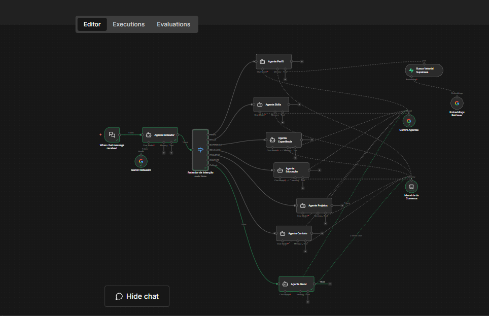
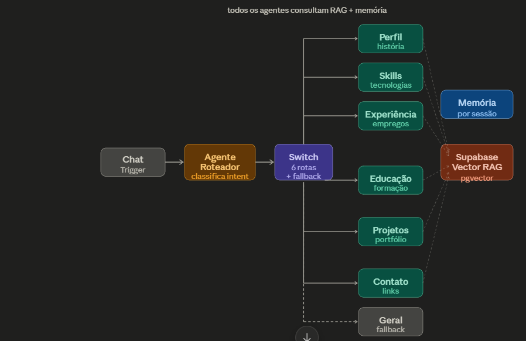

# 🤖 chatBruno — Assistente Virtual Multi-Agente com RAG

<div align="center">


[](https://n8n.io)
[](https://langchain.com)
[](https://supabase.com)
[](https://ai.google.dev)
[](https://postgresql.org)
[](https://aws.amazon.com)

[](https://opensource.org/licenses/MIT)
[]()
[](https://brunokobi.netlify.app)

<br/>

> **Assistente virtual inteligente com arquitetura Multi-Agente + RAG (Retrieval Augmented Generation), construído sobre n8n, LangChain, Supabase pgvector e Google Gemini — hospedado em instância própria na AWS EC2.**

<br/>

[🌐 Portfolio](https://brunokobi.netlify.app) · [🚀 Portfolio 3D](https://brunokobi3d.netlify.app) · [💻 GitHub](https://github.com/brunokobi) · [🔗 LinkedIn](https://linkedin.com/in/brunokobi)

</div>




<br/>

---

## 📋 Índice

- [Visão Geral](#-visão-geral)
- [Arquitetura](#-arquitetura)
- [Stack Tecnológico](#-stack-tecnológico)
- [Conceitos Aplicados](#-conceitos-aplicados)
- [Estrutura Multi-Agente](#-estrutura-multi-agente)
- [Pipeline RAG](#-pipeline-rag)
- [Base de Conhecimento Vetorial](#-base-de-conhecimento-vetorial)
- [Infraestrutura](#-infraestrutura)
- [Como Executar](#-como-executar)
- [Workflows n8n](#-workflows-n8n)
- [Keep-Alive Automático](#-keep-alive-automático)
- [Autor](#-autor)

---

## 🎯 Visão Geral

O **chatBruno** é um assistente virtual de última geração que representa a confluência de múltiplas tecnologias de IA aplicada. Em vez de depender de um único agente com contexto estático no system prompt, o projeto implementa uma **arquitetura multi-agente especializada** onde cada agente é responsável por um domínio específico de conhecimento.

A base de conhecimento é armazenada como **vetores semânticos** no Supabase com extensão `pgvector`, permitindo **busca por similaridade semântica** (não apenas palavras-chave). Quando o usuário faz uma pergunta, o sistema recupera automaticamente os chunks mais relevantes da base e os injeta no contexto do agente especializado correspondente — isso é o padrão **RAG (Retrieval Augmented Generation)**.

### Por que Multi-Agente + RAG?

| Abordagem | Limitação |
|---|---|
| System prompt estático | Contexto fixo, sem atualização dinâmica, tokens desperdiçados |
| Agente único com RAG | Responde tudo, sem especialização por domínio |
| **Multi-Agente + RAG** ✅ | Cada agente especializado busca apenas o que é relevante para seu domínio |

---

## 🏗️ Arquitetura

```
                        ┌─────────────────────────────────────────────┐
                        │              AWS EC2 (Self-Hosted)           │
                        │                                              │
  Usuário               │   ┌──────────┐    ┌────────────────────┐    │
    │                   │   │  Chat    │    │  Agente Roteador   │    │
    │ mensagem          │   │ Trigger  │───▶│  (Gemini Flash)    │    │
    ▼                   │   │ (Webhook)│    │  classifica intent │    │
  Interface Web ────────┼──▶│  n8n     │    └─────────┬──────────┘    │
                        │   └──────────┘              │               │
                        │                             ▼               │
                        │                    ┌────────────────┐       │
                        │                    │  Switch Router │       │
                        │                    │  6 rotas +     │       │
                        │                    │  fallback      │       │
                        │                    └───────┬────────┘       │
                        │              ┌─────────────┼─────────────┐  │
                        │              ▼             ▼             ▼  │
                        │        ┌──────────┐ ┌──────────┐ ┌──────────┐│
                        │        │ Agente   │ │ Agente   │ │ Agente   ││
                        │        │ Perfil   │ │ Skills   │ │Experiênc ││
                        │        └────┬─────┘ └────┬─────┘ └────┬─────┘│
                        │             │             │             │      │
                        │             └─────────────┼─────────────┘      │
                        │                           ▼                    │
                        │              ┌────────────────────────┐        │
                        │              │   Supabase pgvector    │        │
                        │              │   match_documents()    │        │
                        │              │   busca semântica      │        │
                        │              └────────────────────────┘        │
                        └─────────────────────────────────────────────────┘
```

---

## 🛠️ Stack Tecnológico

### Orquestração & Automação
| Tecnologia | Versão | Uso |
|---|---|---|
| **n8n** | Self-hosted (AWS EC2) | Orquestração de todos os workflows |
| **LangChain** (via n8n) | Latest | Pipeline RAG e encadeamento de agentes |

### Inteligência Artificial
| Tecnologia | Modelo | Uso |
|---|---|---|
| **Google Gemini** | `gemini-pro` | LLM principal dos agentes |
| **Google Gemini Embeddings** | `text-embedding-004` | Vetorização de documentos (768 dim) |

### Banco de Dados Vetorial
| Tecnologia | Extensão | Uso |
|---|---|---|
| **Supabase** | `pgvector` | Armazenamento de embeddings |
| **PostgreSQL** | `ivfflat index` | Busca por similaridade cosseno |

### Infraestrutura
| Tecnologia | Uso |
|---|---|
| **AWS EC2** | Hospedagem self-hosted do n8n |
| **Supabase Free Tier** | Banco vetorial com keep-alive automático |

---

## 🧠 Conceitos Aplicados

### RAG — Retrieval Augmented Generation

RAG é uma técnica que combina busca em base de conhecimento com geração de texto pelo LLM. Em vez de confiar apenas no conhecimento pré-treinado do modelo, o sistema:

1. **Vetoriza** a pergunta do usuário usando embeddings
2. **Busca** os chunks mais semanticamente similares no banco vetorial
3. **Injeta** o contexto recuperado no prompt do agente
4. **Gera** uma resposta fundamentada nos dados reais

```
Pergunta → Embedding → Busca Vetorial → Contexto → LLM → Resposta
```

Isso elimina alucinações e garante que o agente responda apenas com informações verídicas da base de conhecimento.

### Embeddings & Similaridade Semântica

Cada chunk de texto é convertido em um vetor de **768 dimensões** pelo modelo `text-embedding-004` do Google. A busca é feita por **distância cosseno** — quanto mais próximos dois vetores no espaço multidimensional, mais semanticamente similares são os textos.

```sql
-- Busca os 5 chunks mais relevantes para a pergunta
SELECT content, 1 - (embedding <=> query_embedding) AS similarity
FROM documents
ORDER BY embedding <=> query_embedding
LIMIT 5;
```

### Arquitetura Multi-Agente

Cada agente é especializado em um domínio, recebe o mesmo acesso ao Supabase RAG, mas tem um system prompt otimizado para seu contexto específico. O **Agente Roteador** atua como dispatcher, classificando a intenção da mensagem antes de direcionar para o especialista correto.

```
Intenção detectada → Agente especializado → Contexto RAG → Resposta otimizada
```

---

## 👥 Estrutura Multi-Agente

O sistema é composto por **8 agentes** com papéis distintos:

```
┌─────────────────────────────────────────────────────────────┐
│                    AGENTE ROTEADOR                          │
│  Analisa a mensagem e retorna: PERFIL | SKILLS |            │
│  EXPERIENCIA | EDUCACAO | PROJETOS | CONTATO | GERAL        │
└─────────────────────────────────────────────────────────────┘
         │
         ▼
┌──────────────────────────────────────────────────────────────────────┐
│                         AGENTES ESPECIALIZADOS                       │
│                                                                      │
│  🧑 Agente Perfil      → história, filosofia, transição de carreira  │
│  ⚙️  Agente Skills      → linguagens, frameworks, ferramentas         │
│  💼 Agente Experiência → empresas, cargos, períodos, tecnologias     │
│  🎓 Agente Educação    → formação, mestrado, pesquisas               │
│  🚀 Agente Projetos    → portfólio, detalhes técnicos, impacto       │
│  📬 Agente Contato     → links, email, redes sociais                 │
│  🔄 Agente Geral       → fallback para perguntas não classificadas   │
└──────────────────────────────────────────────────────────────────────┘
         │
         ▼
┌─────────────────────────────────────────────────────────────┐
│              RECURSOS COMPARTILHADOS                        │
│  📦 Supabase Vector Store (RAG)                             │
│  🧠 Window Buffer Memory (histórico por sessão)             │
│  🔢 Google Gemini Embeddings (text-embedding-004)           │
└─────────────────────────────────────────────────────────────┘
```

---

## 🔍 Pipeline RAG

### Fase 1 — Ingestão (execução única)

```
Chunks de texto
      │
      ▼
Google Gemini Embeddings (text-embedding-004)
      │  768 dimensões por chunk
      ▼
Supabase PostgreSQL + pgvector
      │  tabela: documents
      │  índice: ivfflat (cosine)
      ▼
Base de conhecimento vetorial pronta
```

### Fase 2 — Consulta (em tempo real)

```
Pergunta do usuário
      │
      ▼
Agente Roteador (classifica intenção)
      │
      ▼
Switch → Agente Especializado
      │
      ▼
Tool: buscar_conhecimento_bruno
      │  vetoriza a pergunta
      │  match_documents() → top 5 chunks
      ▼
Contexto injetado no prompt
      │
      ▼
Google Gemini gera resposta contextualizada
```

---

## 📚 Base de Conhecimento Vetorial

A base é composta por **22 chunks** organizados por categoria semântica:

| Categoria | Chunks | Conteúdo |
|---|---|---|
| `identidade` | 1 | Nome, cargo, localização |
| `resumo` | 1 | História e filosofia de vida |
| `sobre` | 1 | Paixões e objetivos pessoais |
| `skills` | 1 | Stack tecnológico completo |
| `educacao` | 5 | UFES, IFES (2x), Unisales, Técnico |
| `experiencia` | 5 | Vennx, Ambipar (2x), Directy, Ecosoft, Infovix |
| `projeto` | 6 | Presence Now, Guia Alimentar BR, Quiz, Placas, Portfolio, Portfolio 3D |
| `contato` | 1 | Links, email, telefone |
| `certificacoes` | 1 | Microsoft, Deep Learning, Scrum, NLW |

### Schema da Tabela

```sql
CREATE TABLE documents (
  id        BIGSERIAL PRIMARY KEY,
  content   TEXT NOT NULL,              -- Texto do chunk
  metadata  JSONB DEFAULT '{}',         -- categoria, fonte, empresa, etc.
  embedding VECTOR(768)                 -- Vetor gerado pelo Gemini
);

-- Índice para busca eficiente por similaridade cosseno
CREATE INDEX documents_embedding_idx
  ON documents USING ivfflat (embedding vector_cosine_ops)
  WITH (lists = 100);
```

### Função de Busca Semântica

```sql
CREATE OR REPLACE FUNCTION match_documents(
  query_embedding VECTOR(768),
  match_count     INT DEFAULT 5,
  filter          JSONB DEFAULT '{}'
) RETURNS TABLE (
  id         BIGINT,
  content    TEXT,
  metadata   JSONB,
  similarity FLOAT
) AS $$
BEGIN
  RETURN QUERY
  SELECT
    documents.id,
    documents.content,
    documents.metadata,
    1 - (documents.embedding <=> query_embedding) AS similarity
  FROM documents
  WHERE metadata @> filter
  ORDER BY documents.embedding <=> query_embedding
  LIMIT match_count;
END;
$$ LANGUAGE plpgsql;
```

---

## ☁️ Infraestrutura

### AWS EC2 (n8n Self-Hosted)

O n8n roda em uma instância EC2 própria, eliminando dependência de planos pagos de plataformas SaaS e garantindo:
- Controle total sobre os dados
- Sem limites de execução por plano
- Customização completa dos workflows

### Supabase (Free Tier Otimizado)

Para manter o projeto ativo no plano gratuito do Supabase (que pausa após 7 dias de inatividade), o sistema inclui um **workflow de keep-alive** que executa automaticamente a cada 3 dias.

```
Schedule Trigger (a cada 3 dias)
         │
         ├──▶ HTTP GET → projeto 1 (lxkobnubawhqndboxgwj)
         │
         └──▶ HTTP GET → projeto 2 (xztrtmjhhrdxubcrgwaa)
```

---

## 🚀 Como Executar

### Pré-requisitos

- n8n self-hosted (AWS EC2 ou local)
- Conta Supabase (free tier funciona)
- Google AI API Key (Gemini)

### 1. Configurar o Banco Vetorial

Execute o arquivo `setup_supabase_bruno.sql` no SQL Editor do Supabase:

```bash
# Acesse o SQL Editor em:
# https://supabase.com/dashboard/project/SEU_PROJECT_ID/sql/new
```

O script irá:
- Habilitar a extensão `pgvector`
- Criar a tabela `documents` com suporte a vetores de 768 dimensões
- Criar índice `ivfflat` para busca eficiente
- Criar a função `match_documents` para busca semântica
- Inserir os 22 chunks da base de conhecimento

### 2. Gerar os Embeddings (Ingestão)

Importe e execute o workflow `ingestao_supabase_bruno.json` no n8n:

1. **Settings → API → Service Role Key** (não a anon key!)
2. Configure a credencial **Supabase API** no n8n
3. Execute o workflow manualmente uma vez
4. Os 22 chunks receberão seus embeddings vetoriais

### 3. Ativar o Chat Multi-Agente

Importe o workflow `chatBruno_multiagente_rag.json` no n8n:

1. Configure a credencial **Supabase API** no nó `Busca Vetorial Supabase`
2. As credenciais do Google Gemini já estão referenciadas
3. Ative o workflow
4. O webhook público estará disponível para integração

### 4. Ativar o Keep-Alive

Importe o workflow `supabase_ping.json` e ative-o para manter os projetos Supabase ativos automaticamente.

---

## 📁 Workflows n8n

| Arquivo | Descrição | Trigger |
|---|---|---|
| `chatBruno_multiagente_rag.json` | Agente principal com multi-agente + RAG | Webhook (chat público) |
| `ingestao_supabase_bruno.json` | Gera embeddings e popula o Supabase | Manual (execução única) |
| `supabase_ping.json` | Keep-alive dos projetos Supabase | Schedule (a cada 3 dias) |
| `setup_supabase_bruno.sql` | Schema + dados iniciais do banco vetorial | SQL Editor Supabase |

---

## ⏰ Keep-Alive Automático

O plano gratuito do Supabase pausa projetos após 7 dias de inatividade. O workflow de keep-alive resolve isso com um ping automático a cada 3 dias:

```json
{
  "schedule": "a cada 3 dias",
  "projetos": [
    "lxkobnubawhqndboxgwj (presensenow)",
    "xztrtmjhhrdxubcrgwaa (chatBruno RAG)"
  ],
  "metodo": "GET /rest/v1/ com anon key"
}
```

---

## 👨‍💻 Autor

<div align="center">

**Bruno Kobi Valadares de Amorim**

*Desenvolvedor Full Stack | IA & Automação | Mestrando em Computação Aplicada*

[](https://brunokobi.netlify.app)
[](https://brunokobi3d.netlify.app)
[](https://github.com/brunokobi)
[](https://linkedin.com/in/brunokobi)

</div>

---

<div align="center">

**Vamos construir o futuro juntos! 🚀**

*Serra, Espírito Santo, Brasil*

</div>
